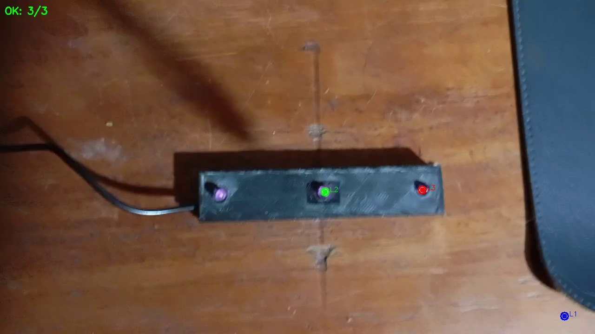

# Detección de Centros Ópticos en Patrones de Referencia Móviles

[](https://www.python.org/)
[](https://opencv.org/)
[](README.md)

> **Sistema de detección de marcadores LED para aplicaciones de Helmet Mounted Display (HMD)**

Proyecto en desarrollo para la detección automática de marcadores LED infrarojos y el cálculo de sus centros ópticos, aplicado al trackeo de cascos en tiempo real.

---

## Descripción

Este proyecto desarrolla un sistema de visión por computadora para detectar marcadores LED infrarojos y calcular sus centros ópticos con precisión, orientado al trackeo de Helmet Mounted Displays (HMD) en entornos aeronáuticos.

### Objetivos

1. Detectar marcadores LED en condiciones variables de iluminación
2. Calcular centros ópticos minimizando errores
3. Operar compatible con video en tiempo real
4. Minimizar falsos positivos mediante validación geométrica

---

## Estado del Proyecto

El proyecto se estructura en etapas incrementales:

| Etapa | Descripción | Estado |
|-------|-------------|--------|
| **Etapa 1** | Detección básica multi-método | ⚠️ Experimental (falsos positivos) |
| **Etapa 2** | Validación geométrica + Kalman | ✅ Implementado |
| **Etapa 3** | Ensayos de validación | 🔄 Pendiente |

---

## Etapas Implementadas

### Etapa 1: Detección Básica

Detector multi-método que combina 4 técnicas en paralelo:
- Umbralización simple y adaptativa
- Transformada de Hough para círculos
- Segmentación HSV

**Limitación:** Encuentra puntos brillantes pero sin validar que sean el patrón real. Alta tasa de falsos positivos.

**Resultados:**


📁 Carpeta: `estimacion_centros_opticos/etapa1_deteccion_basica/`

### Etapa 2: Validación Geométrica + Kalman

Mejora la detección aplicando:
- **Validación geométrica estricta**: Solo acepta tripletes colineales y equiespaciados
- **Filtro de Kalman**: Suaviza trayectorias y reduce jitter
- **Generación de video**: Exporta video con centros ópticos marcados

**Resultados:**


📁 Carpeta: `estimacion_centros_opticos/etapa2_kalman_parpadeo/`

---

## Estructura del Proyecto

```
Estimacion-Pose-Casco/
├── README.md                           # Este archivo
│
└── estimacion_centros_opticos/         # Módulo principal
    │
    ├── patron_leds/                    # Videos de prueba
    │   ├── patron_leds.mp4             # Video original
    │   └── patron_leds_marcado.mp4     # Video con LEDs marcados
    │
    ├── etapa1_deteccion_basica/        # Etapa 1
    │   ├── led_detector_final.py       # Detector multi-método
    │   ├── run.sh                      # Script de ejecución
    │   ├── resultados/                 # Salida del detector
    │   └── README.md
    │
    └── etapa2_kalman_parpadeo/         # Etapa 2
        ├── led_detector_estricto.py    # Detector con validación geométrica
        ├── generar_video_marcado.py    # Genera video con LEDs dibujados
        ├── generar_video_parpadeo.py   # Genera video con parpadeo simulado
        ├── resultados_estricto/        # Salida del detector
        └── README.md
```

---

## Instalación

```bash
# Clonar repositorio
git clone https://github.com/TOB1EH/Proyecto-Deteccion-de-centros-opticos-en-patrones-de-referencia-moviles-aplicados.git
cd Proyecto-Deteccion-de-centros-opticos-en-patrones-de-referencia-moviles-aplicados

# Crear entorno virtual
cd estimacion_centros_opticos
python3 -m venv .venv
source .venv/bin/activate

# Instalar dependencias
pip install opencv-python numpy
```

---

## Uso Rápido

### Etapa 1: Detector básico

```bash
cd estimacion_centros_opticos/etapa1_deteccion_basica
python3 led_detector_final.py ../patron_leds/patron_leds.mp4
```

### Etapa 2: Detector estricto

```bash
cd estimacion_centros_opticos/etapa2_kalman_parpadeo
python3 led_detector_estricto.py ../patron_leds/patron_leds.mp4
```

### Generar video con centros ópticos marcados

```bash
cd estimacion_centros_opticos/etapa2_kalman_parpadeo
python3 generar_video_marcado.py ../patron_leds/patron_leds.mp4
```

Genera `patron_leds_marcado.mp4` con los 3 LEDs dibujados en tiempo real.

---

## Requisitos

- Python 3.10+
- OpenCV 4.x (`opencv-python`)
- NumPy

---


## Autor

**Tobias Funes**  
Facultad de Ingeniería - Instituto Universitario Aeronáutico (IUA)  
Diciembre 2025

---

## Enlaces

- [Repositorio GitHub](https://github.com/TOB1EH/Proyecto-Deteccion-de-centros-opticos-en-patrones-de-referencia-moviles-aplicados)
- [Documentación OpenCV](https://docs.opencv.org/)
