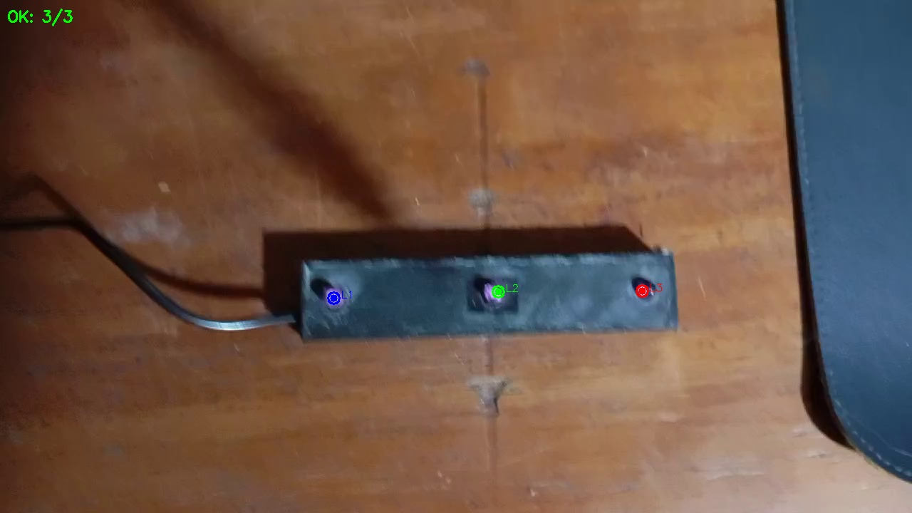
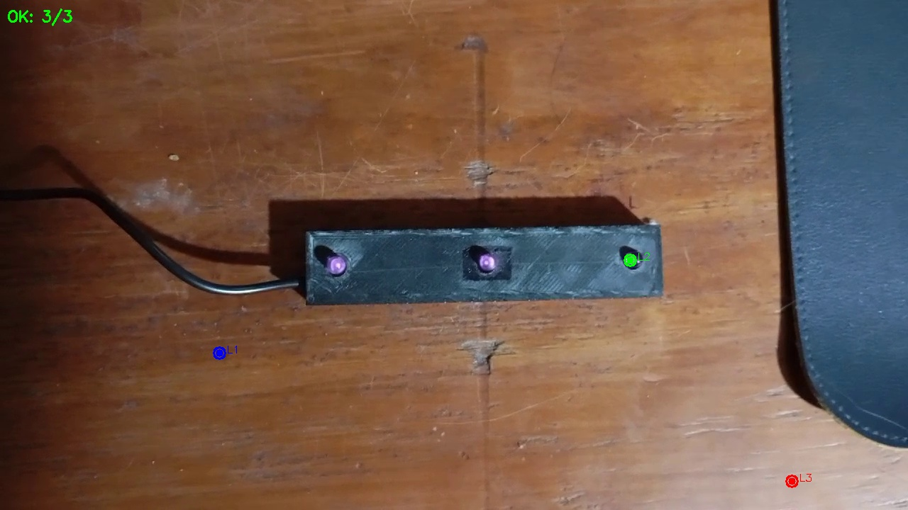

# Etapa 1: Detección Básica de LEDs

## Descripción

Primera etapa del proyecto de estimación de pose. Implementa un detector multi-método para identificar 3 LEDs infrarojos en video.

## Estado Actual

⚠️ **Etapa experimental** - Este detector encuentra puntos brillantes en el video, pero **no valida** que sean el patrón de LEDs real. La mayoría de las detecciones son falsos positivos.

### Limitaciones

- Sin validación geométrica (no verifica colinealidad ni distancias)
- No distingue LEDs reales de otros puntos brillantes
- Sirve como base experimental para la Etapa 2

## Ejecución

Desde la carpeta `etapa1_deteccion_basica/`:

```bash
# Ejecución directa
python3 led_detector_final.py ../patron_leds/patron_leds.mp4

# Sin ventana de visualización
python3 led_detector_final.py ../patron_leds/patron_leds.mp4 --no-display

# Script automático
bash run.sh
```

**Algunos Resultados:**






### Argumentos

| Argumento | Descripción | Default |
|-----------|-------------|---------|
| `video` | Ruta al video | (requerido) |
| `--output, -o` | Carpeta de salida | `resultados/` |
| `--max-frames, -n` | Límite de frames | todos |
| `--no-display` | Sin ventana | con ventana |

## Salida

```
resultados/
├── frames/               # Frames con detecciones marcadas
└── reporte_deteccion.txt # Resumen de la detección
```

## Técnicas Implementadas

El detector combina 4 métodos en paralelo:

1. **Umbralización simple** (>200) + componentes conexos
2. **Umbralización adaptativa** (vecindario 31×31)
3. **Transformada de Hough** para círculos
4. **Segmentación HSV** por canal de brillo

## Archivos

- `led_detector_final.py` - Detector principal
- `run.sh` - Script de ejecución

## Siguiente Etapa

La validación real del patrón de LEDs se implementa en **Etapa 2** (`../etapa2_kalman_parpadeo/`):

- Validación geométrica estricta (colinealidad, ratio de distancias)
- Filtro de Kalman para suavizar trayectorias
- Generador de video con centros ópticos marcados

## Autor

Tobias Funes
