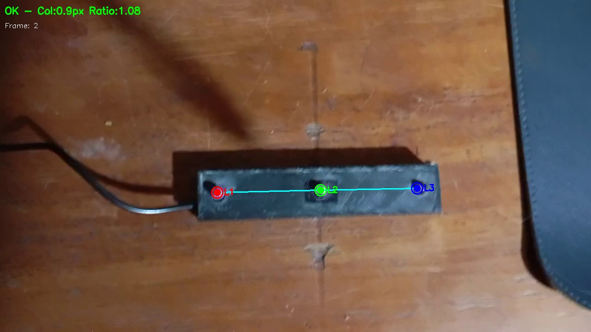

# Etapa 2: Detección Estricta con Validación Geométrica + Kalman

## Descripción

Esta etapa mejora la detección de la Etapa 1 implementando:

- **Validación geométrica estricta**: Solo acepta tripletes que formen el patrón correcto
- **Filtro de Kalman**: Suaviza las trayectorias y reduce jitter
- **Generación de video**: Exporta video con centros ópticos marcados

**Filosofía**: "Mejor NO detectar que detectar MAL"

## Problema que Resuelve

La Etapa 1 detectaba cualquier 3 puntos brillantes sin validar que fueran el patrón real de LEDs. Esta etapa aplica restricciones geométricas para filtrar falsos positivos.

---

## Ejecución

Desde la carpeta `etapa2_kalman_parpadeo/`:

### Detector estricto

```bash
# Con video original
python3 led_detector_estricto.py ../patron_leds/patron_leds.mp4

# Con carpeta de salida personalizada
python3 led_detector_estricto.py ../patron_leds/patron_leds.mp4 -o mis_resultados/
```

**Resultados:**



### Generar video con centros ópticos marcados

```bash
# Genera video_marcado.mp4 con los LEDs dibujados
python3 generar_video_marcado.py ../patron_leds/patron_leds.mp4

# Con nombre de salida específico
python3 generar_video_marcado.py ../patron_leds/patron_leds.mp4 -o salida.mp4
```

**Resultados:**


### Generar video con parpadeo simulado (opcional)

```bash
python3 generar_video_parpadeo.py ../patron_leds/patron_leds.mp4 \
    videos_parpadeo/patron_parpadeo.mp4
```

---

## Argumentos

### led_detector_estricto.py

| Argumento | Descripción | Default |
|-----------|-------------|---------|
| `video` | Ruta al video | `../patron_leds/patron_leds.mp4` |
| `-o, --output` | Carpeta de salida | `resultados_estricto/` |
| `-n, --max-frames` | Límite de frames | todos |

### generar_video_marcado.py

| Argumento | Descripción | Default |
|-----------|-------------|---------|
| `video` | Video de entrada | `../patron_leds/patron_leds.mp4` |
| `-o, --output` | Video de salida | `<nombre>_marcado.mp4` |
| `-n, --max-frames` | Límite de frames | todos |
| `-p, --preview` | Mostrar preview | no |
| `--no-trajectory` | Sin trayectoria | con trayectoria |

### generar_video_parpadeo.py

| Argumento | Descripción | Default |
|-----------|-------------|---------|
| `video_entrada` | Video original | (requerido) |
| `video_salida` | Video de salida | (requerido) |
| `-f, --frecuencia` | Hz de parpadeo | 10 |

---

## Salida

### led_detector_estricto.py

```
resultados_estricto/
├── frames/           # Todos los frames procesados
└── reporte.txt       # Resumen de la detección
```

### generar_video_marcado.py

```
<video>_marcado.mp4   # Video con LEDs dibujados en tiempo real
```

---

## Restricciones Geométricas

El detector solo acepta tripletes que cumplan:

- **3 puntos** exactamente
- **Colineales** (bajo error de colinealidad)
- **Equiespaciados** (ratio de distancias cercano a 1.0)
- **Distancia razonable** entre puntos

---

## Archivos

| Archivo | Descripción |
|---------|-------------|
| `led_detector_estricto.py` | Detector con validación geométrica + Kalman |
| `generar_video_marcado.py` | Genera video con centros ópticos dibujados |
| `generar_video_parpadeo.py` | Genera video con parpadeo simulado |

---

## Autor

Tobias Funes - Diciembre 2025
